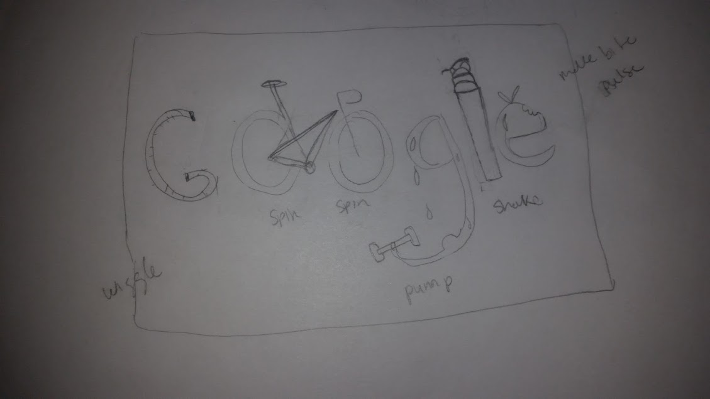
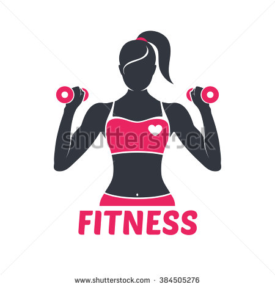
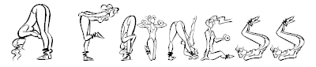

# Google Doodle

## Brainstorm Ideas

              My topic is about fitness. I want to incorporate the word Google into things that deal with  working out, eating healthy, and measuring progress. My idea is to have upbeat music that will motivate you to want to get moving, start pumping weights or do some hardcore cardio. I am planning to draw out the text into shapes of things that go with my theme. I found some fun fonts that would like try out called Alpha fitness. It shaped like a woman doing different yoga and weightlifting poses in the shape of the whole alphabet. 

             I want to do fitness because right now I am all about getting sweaty, pumping weights, and eating healthy. My goals are to grow a booty, slim down my waist, and have toned arms. Best way to get there is to make no excuses, make workouts fun, have yummy-nutritious food to grub on so I don’t get tempted by junkfood.

             My favorite work outs are dancing, pumping weights, and going for jogs with my two dogs. Since the weather has been crappy, I have been doing workout videos for at least thirty minutes four to five times a week. The exercises I do are very intense and very extreme, so thirty minutes is plenty. Best time workout for me is a night because it relaxes me. I must schedule in workouts because if not then I would never have time, because I do an intern job, an office job, go to school fulltime, be a mom, be a girlfriend, and so on.  Having a great sweat session helps me cope with stress and keeps me from going crazy. I love the sore feeling that lasts for three days, oh that’s the best! It feels like I worked hard and it’s a hurt so good kind of feeling. Sometimes, I work out in the morning and it really helps my mood because I feel like a boss and I can handle anything. Even though school is a struggle and I cannot control everything in my life. At least I can control what is going into my body and how treat my body. 
	 
	

## Content Doodle

  
  
  
  
  Music by DJ Giorgio fitness remix 2012
  